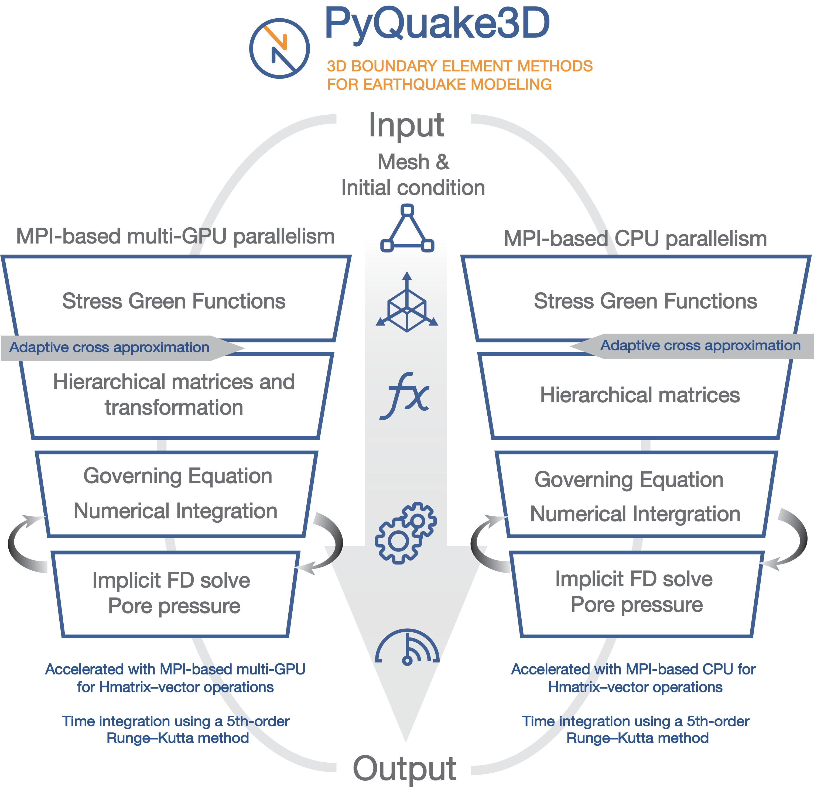

Code Framework
===================================

Usage Modes
-------------------------------------

PyQuake3D supports two execution backends:

**Single CPU/GPU-based backend:** Constructs dense stiffness matrices using direct evaluation of all source–receiver interactions. GPU acceleration is implemented via CuPy, and parallelism is handled using Python’s ProcessPoolExecutor for kernel calculations.

**MPI-based CPU backend:** Implements a memory-efficient H-matrix representation of the stiffness matrix, distributed across multiple processors using mpi4py. This version is well-suited for simulations with >40,000 elements and optimized for HPC systems.

This structure allows users to scale from fast exploratory models on local machines to high-resolution, physics-rich earthquake simulations on supercomputing clusters. The modular design also facilitates extension of the framework to include additional rheologies, boundary conditions, or coupling with geodynamic models.
PyQuake3D can be executed either in single CPU/GPU mode (:file:main_gpu.py) or in MPI-parallel mode (:file:main_mpi.py), depending on the size of your model. All simulations are launched from the project’s root directory using the :file:main_gpu.py and :file:main_mpi.py scripts located in the :file:src folder.

.. note::
   The CPU/GPU version only supports the regular seismic cycle simulation, without adding fluid-related properties, and is not suitable for larger models with cells exceeding 40,000.

Code Structure and File Description
-------------------------------------

The PyQuake3D source code is organized to reflect its modular architecture and
hybrid parallel computing design (:numref:`fig-framework`). All core Python
modules are located in the ``src`` directory, while model configurations and
parameter files are provided in the ``examples`` folder. The ``examples``
directory contains predefined models, including the ``BP5-QD`` benchmark based
on the Southern California Earthquake Center's SEAS community validation
project [https://strike.scec.org/cvws/seas/download/].

The PyQuake3D codebase is structured around distinct computational tasks:

- ``main.py``: Entry point for running the quasi-dynamic simulations. It handles
  the model setup, time integration, and output generation. Users may customize
  this script for advanced diagnostics or automated post-processing.

- ``QDsim.py`` and ``QDsim_gpu.py``: Defines the ``QDsim`` class, which
  encapsulates the governing equations, numerical integrator, and interface to
  the selected Green’s function backend (dense in ``QDsim_gpu.py`` or
  hierarchical in ``QDsim.py``).

  - ``QDsim.Init_condition()``: Setting initial condition of fault model.
  - ``QDsim.simu_forward()``: Model forward calculation.

- ``DH_Greenfunction.py`` and ``SH_Greenfunction.py``: Compute the displacement
  and stress Green’s functions for homogeneous elastic half-space and full-space
  media, respectively.

- ``TDstressFS_C.cpp``: Compute the stress Green’s functions for homogeneous
  elastic half-space and full-space media using C++ language.

- ``Hmatrix.py``: Constructs and applies the hierarchical matrix representation
  based on Adaptive Cross Approximation (ACA), optimized for distributed-memory
  parallelism using ``mpi4py``.

  - ``QDsim.create_recursive_blocks()``: Recursively build the blocktree.
  - ``QDsim.createHmatrix()``: Build the Hmatrix.
  - ``tree_block.master()``: Dynamically allocate MPI tasks.
  - ``tree_block.worker()``: Excute MPI tasks of calculating stress green's
    functions.
  - ``tree_block.tree_block.parallel_block_scatter_send()``: Distribute
    sub-matrices of the fully built Hmatrix to each process.

- ``Readmsh.py``: Parses unstructured mesh files (in ``.msh`` format) and imports
  model geometry, fault segmentation, and material parameters.

.. _fig-framework:

   Overview of the PyQuake3D computational framework. The workflow includes input setup, solver implementation 
   on GPU or CPU architectures, and output diagnostics. The GPU version uses dense matrix–vector operations accelerated with CUDA, 
   while the CPU version applies hierarchical matrix compression and MPI-based parallelism.