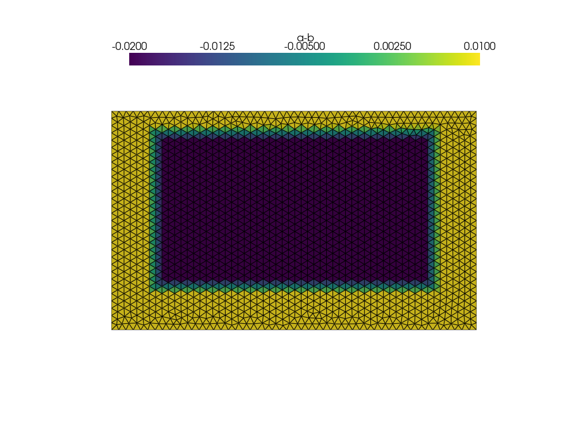
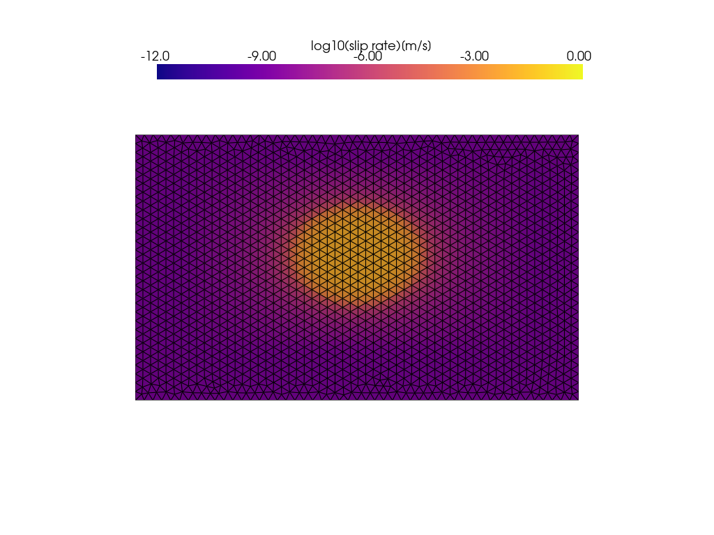

Installation and Tutorials
====================================
We provides a step-by-step guide to use **PyQuake3D**. We'll cover installation, compilation, setup, and running a simple simulation. 

The core code of PyQuake3D no longer supports running on Windows, focusing instead on MPI parallel multi-CPU or GPU operation. However, 
to facilitate use by beginners, we retain the Standard Execution single GPU/CPU version on Windows, 
but this version will no longer be updated. You may test it if you only have Windows system, but we recommend using Linux for better performance and more features.

We first show the Standard Execution single GPU/CPU version on Windows. The same guide from jupyter-based tutorials are available from:

https://github.com/Computational-Geophysics/PyQuake3D/blob/main/tutorials

How to install PyQuake3D
----------------------------------------------------

**Step 1: Set Up Conda environment**

#. Download from https://www.anaconda.com/docs/getting-started/miniconda/install
#. Then install it using exe program.
#. Open miniconda Prompt and navigate to the working directory (e.g. E:\work) using: E: then cd E:\work
#. After installation, create a new environment: ``conda create -n PyQuake3D python=3.12``
#. Activate the environment: ``conda activate PyQuake3D``
#. Install Jupyter notebook using: ``conda install jupyter notebook``

**Step 2: Install Python Dependencies**

#. Download from https://github.com/Computational-Geophysics/PyQuake3D
#. Install PyQuake3D in conda Prompt using pip:

   *python -m pip install -e .*

   (make sure PyQuake3D environment is activated)

**Python Requirements**
    * numpy
    * scipy
    * matplotlib
    * psutil
    * mpi4py
    * joblib
    * imageio
    * pyvista
    * mpi4py
    * torch

.. note::
   PyQuake3D supports Python 3.8 and above, so there is no need to specify a specific version when installing the library.

Runing a simple case
---------------------------------------------------------------------------

The easiest way to run pyquake3d is to run the single CPU version of Pyquake3D, without installing cupy. **Here we provide a BP5-QD simulation with low resolution, with initial paremeters being set up in parameter.txt.** The procedures are follows:

#. Read model and mesh parameter (Please refer to mannul for specific meanning).
#. Calculating Green functions.
#. Calculating Qusi-Dynamic model.
#. Visualize the results.

You can also run the BP5-QD example case in the terminal:

.. code-block:: bash

   python -m src.main_gpu -g examples/BP5-QD/bp5t.msh -p examples/BP5-QD/parameter.txt

.. note::
   The single CPU/GPU version only supports the regular seismic cycle simulation, without adding fluid-related properties, 
   and is not suitable for larger models with cells exceeding 40,000. It does not update anymore.

**Initial: Import all sub-functions and libraries**

.. code-block:: python
   :caption: Import all sub-functions and libraries

   #Let runing PyQuake3D
    #First Import all sub-functions

    import pyquake3d.readmsh as readmsh
    import numpy as np
    import sys
    import matplotlib.pyplot as plt
    import pyquake3d.QDsim_gpu as QDsim_gpu
    from math import *
    import time
    import argparse
    import os
    import psutil
    from datetime import datetime
    process = psutil.Process(os.getpid())

**Step 1: read the model file, parameter file, and create a basic class**

.. code-block:: python
   :caption: read the model

   fnamegeo='BP5_3k/bp5t.msh'
   fnamePara='BP5_3k/parameter.txt'
   nodelst,elelst=readmsh.read_mshV2(fnamegeo)

**Create mesh model through Gmesh**

You can create your own mesh model through Gmesh, download from https://gmsh.info/. You can download the latest version, but remember to use version 2 when exporting mesh model. First you need to prepare .geo file, and open it using Gmesh and it automatically mesh the domain. Then expot .msh file by ``File->export->Input bp5t.msh->Version 2 ASCII``).

A simple asperity_circle.geo format and notes are as follows:

.. code-block:: python
   :caption: A simple asperity_circle.geo file

   // Parameters
   angle = 25;   // Dip angle of the fault in degrees
   Len = 100;    // Fault length along x-axis
   width = 40;   // Fault width along z-axis
   lc = 1.5;     // Characteristic length for mesh cell size

   // Define points for the rectangular fault plane
   Point(1) = {-Len/2, 0, 0, lc};   // Bottom-left corner (A)
   Point(2) = {Len/2, 0, 0, lc};    // Bottom-right corner (B)
   Point(3) = {Len/2, 0, -width, lc}; // Top-right corner (C)
   Point(4) = {-Len/2, 0, -width, lc}; // Top-left corner (D)

   // Alternative points for a dipping fault (commented out)
   //Point(3) = {Len/2, width * Cos(angle * Pi / 180), -width * Sin(angle * Pi / 180), lc};
   //Point(4) = {-Len/2, width * Cos(angle * Pi / 180), -width * Sin(angle * Pi / 180), lc};

   // Define lines connecting the points
   Line(1) = {1, 2}; // Line from A to B (bottom edge)
   Line(2) = {2, 3}; // Line from B to C (right edge)
   Line(3) = {3, 4}; // Line from C to D (top edge)
   Line(4) = {4, 1}; // Line from D to A (left edge)

   // Define the surface by creating a line loop and plane
   Line Loop(1) = {1, 2, 3, 4}; // Closed loop of lines A-B-C-D
   Plane Surface(1) = {1};      // Create a planar surface from the line loop

   // Mesh generation settings
   //Mesh.Algorithm = 1;       // Delaunay triangulation
   //Mesh.Algorithm = 8;       //Structured quadrilateral mesh
   //Mesh.ElementOrder = 1;    // Use first-order
   //Mesh.RecombineAll = 1;    // Recombine triangles

   // Generate the 2D mesh
   Mesh 2;

   // Save the mesh to a file
   Mesh.Format = 2;             // Output format: 1 = MSH1 format (Gmsh legacy format)
   //Save "fault_mesh.msh";       // Save the mesh as fault_mesh.msh

**Create parameter and external input file**

The parameter.txt file serves as a configuration file for the simulation, defining all necessary parameters to control the execution of the model. It organizes input data into distinct sections for clarity and modularity, including:

#. **Files and Cells**: Specifies file paths and mesh cell size settings.
#. **Property:** Defines material properties of the fault, such as elastic moduli or density.
#. **Fluid:** Configures fluid-related parameters, like Dilatancy coefficient or pore pressure.
#. **Stress:** Sets stress conditions applied to the fault, such as normal or shear stress.
#. **Friction:** Describes frictional properties, including friction coefficients or laws.
#. **Nucleation:** Defines parameters for initiating fault slip, such as nucleation zone size or critical stress.
#. **Output:** Configures output settings, including data formats and variables to save.

If external data is imported as the initial model, just set **InputHetoparamter: True**, and stress and friction parameters can be ignored.

.. Note::
   Please refer to section :doc:`parameter` for a detailed explanation of each parameter. The order of all parameters in parameter.txt can be arbitrarily disrupted, but the parameter names must remain strictly unchanged.

**Visualize mesh model using PyQuake3D**

All initial parameters are easily accessible through class member variables.

.. code-block:: python
   :caption: Visualize mesh model

   # Establish the initial model and generate simulation class
   sim0 = QDsim_gpu.QDsim(elelst, nodelst, fnamePara, calc_greenfunc=False)

   # Ouput initial state
   fname = 'Init.vtk'
   sim0.ouputVTK(fname)

   import pyvista as pv
   plotter = pv.Plotter(off_screen=True)
   mesh = pv.read(fname)
   print(mesh)
   print(mesh.cell_data)

   variab = 'a-b'  # choose the arrays to display

   scalar_bar_args = {
       'title': variab,
       'position_x': 0.22,
       'position_y': 0.85,
   }

   plotter.add_mesh(
       mesh,
       scalars=variab,
       show_edges=True,
       scalar_bar_args=scalar_bar_args
   )  # show shear stress

   plotter.show(cpos='xz')

output:

.. figure1:

   Figure 1:mesh model and spatial distribution of a-b.

**Step 2: calculate greenfunctions,we encapsulate all calculations in a class QDsim**
The Green function calculation is saved in the Corefunc directory defined in parameter.txt. The next time you start the program, you no longer need to calculate the Green function.

.. code-block:: python
   :caption: Calculating core functions
    sim0=QDsim_gpu.QDsim(elelst,nodelst,fnamePara,calc_greenfunc=True)

**Step 3: Calculating Qusi-Dynamic model by loop**

.. code-block:: python
   :caption: Calculating Qusi-Dynamic model by loop

   

    start_time=time.time()
        
    totaloutputsteps=int(sim0.Para0['totaloutputsteps'])
    directory='outvtk'
    if not os.path.exists(directory):
        os.mkdir(directory)

    f=open('state.txt','w')
    f.write('iteration time_step(s) maximum_slip1_rate(m/s) maximum_slip2_rate(m/s) time(s) time(h)\n')

    if(sim0.useGPU==False):  #CPU case
        for i in range(totaloutputsteps): 
            

            if(i==0):
                dttry=sim0.htry
            else:
                dttry=dtnext
            dttry,dtnext=sim0.simu_forward(dttry)
            year=sim0.time/3600/24/365
            if(i%10==0):
                print('iteration:',i)
                print('dt:',dttry,' max_vel:',np.max(np.abs(sim0.slipv)),' Seconds:',sim0.time,'  Days:',sim0.time/3600/24,
                    'year',year)
                memory_info = process.memory_info()
                print(f"Memory usage: {memory_info.rss / (1024 ** 2)} MB")
            f.write('%d %f %.16e %.16e %f %f\n' %(i,dttry,np.max(np.abs(sim0.slipv1)),np.max(np.abs(sim0.slipv2)),sim0.time,sim0.time/3600.0/24.0))

            
            
            if(sim0.Para0['outputvtk']=='True'):
                outsteps=int(sim0.Para0['outsteps']) #output steps
                if(i%outsteps==0):
                    fname=directory+'/step'+str(i)+'.vtk'
                    sim0.ouputVTK(fname)

    end_time = time.time()
    timetake=end_time-start_time
    f.write('Program end time: %s\n'%str(datetime.now()))
    f.write("Time taken: %.2f seconds\n"%timetake)

    print('Program end time: %s\n'%str(datetime.now()))
    print("Time taken: %.2f seconds\n"%timetake)

**Step 4: Visualize Results**

The simulation generates VTK files, visualize them using PyVista.
You can also output all results in your own format by accessing the member variables of sim0 (e.g. sim0.slip).

.. code-block:: python
   :caption: Visualize Results

   

    import pyvista as pv
    import glob
    import os

    # set vtk file path
    folder_path = "outvtk/"  

    vtk_files = glob.glob(os.path.join(folder_path, "*.vtk")) + glob.glob(os.path.join(folder_path, "*.vtu"))

    #read state file for time show
    def is_number(s):
        try:
            float(s) 
            return True
        except ValueError:
            return False

    def readstate(fname):
        f=open(fname,'r')
        K=0
        data0=[]
        for line in f:
            tem=line.split()
            
            if(len(tem)==6 and is_number(tem[0])==True):
                data0.append(np.array(tem).astype(float))
        return np.array(data0)
    state=readstate('state.txt')
    print(state.shape)

    # # show one figure 
    plotter = pv.Plotter(off_screen=True)
    mesh = pv.read(vtk_files[10])
    slip_velocity = mesh['Slipv[m/s]']
    # Apply logarithmic transformation (e.g., base 10)
    # Add small constant (e.g., 1e-10) to avoid log(0) issues
    log_slip_velocity = np.log10(slip_velocity)

    # Assign the transformed scalars back to the mesh
    mesh['Log_Slipv[m/s]'] = log_slip_velocity
    scalar_range = (-12, 0)
    scalar_bar_args={
            'title': 'log10(slip rate)[m/s]',
            'position_x': 0.22, 
            'position_y': 0.85,  
        }
    plotter.add_mesh(mesh, scalars='Log_Slipv[m/s]', cmap="plasma", show_edges=True,clim=scalar_range,scalar_bar_args=scalar_bar_args)  # show shear stress

    #plotter.camera_position =[(0, -5, 0), (0, 0, 0), (0, 0, 1)]
    # plotter.add_scalar_bar(
    #         title='log10(Slip rate)[m/s]',  # Label for the colorbar
    #         position_x=0.25,         # Horizontal position (0 to 1, 0.25 centers it with width=0.5)
    #         position_y=0.05,         # Vertical position (close to bottom)
    #         width=0.5,              # Width of the colorbar (0 to 1, relative to plot)
    #         height=0.1,             # Height of the colorbar
    #         vertical=False          # Horizontal orientation
    #     )
    plotter.show(cpos='xz')

    # create animation
    outsteps=int(sim0.Para0['outsteps'])
    plotter = pv.Plotter(off_screen=True)
    plotter.open_gif('animation.gif')  # Initialize GIF output

    for i, vtk_file in enumerate(vtk_files):
        if(i*outsteps<len(state)):
            mesh = pv.read(folder_path+'step'+str(i*outsteps)+'.vtk')
            slip_velocity = mesh['Slipv[m/s]']
            # Apply logarithmic transformation (e.g., base 10)
            # Add small constant (e.g., 1e-10) to avoid log(0) issues
            log_slip_velocity = np.log10(slip_velocity)
            
            # Assign the transformed scalars back to the mesh
            mesh['Log_Slipv[m/s]'] = log_slip_velocity
            plotter.clear()  # Clear previous mesh
            plotter.add_mesh(
                mesh,
                scalars='Log_Slipv[m/s]',
                cmap="plasma",
                show_edges=False,
                clim=scalar_range,
                scalar_bar_args=scalar_bar_args
            )
            
            timeyear=state[i*outsteps,-1]/365
            plotter.add_text(f"Time: {timeyear:.8f} yr", position="upper_left", font_size=14, color="white", shadow=True)
            plotter.camera_position = 'xz'
            plotter.write_frame()  # Write frame to GIF

    plotter.close()
    print('Video has been saved.')

output:

.. figure2:

   Figure 2: Snapshot of slip rate.

**GPU acceleration**

Install cupy if you want to use GPU acceleration, we recommened to use conda in prompt terminal
(e.g. CUDA 11.8):

``conda install -c conda-forge cupy cudatoolkit=11.8``

.. Note::
    CuPy relies on NVIDIA CUDA for GPU computing, so the following components are required:

1. **NVIDIA GPU Driver**: Ensure your system has a CUDA-capable NVIDIA GPU
   (check compatibility at https://developer.nvidia.com/cuda-gpus).
   The driver version must support the CUDA Toolkit version used by CuPy
   (e.g., CUDA 10.2–12.x for CuPy v13.x).

2. **CUDA Toolkit**: CuPy supports specific CUDA versions
   (check the latest compatibility at https://docs.cupy.dev/en/stable/install.html).
   Common versions: CUDA 11.8 or 12.2 are widely used.

The GPU operates in a similar way to the CPU, only the output is converted to numpy each time.
Reading model and parameters is the same as CPU.

.. Note:: 
   Make sure to set ``GPU:True`` in the ``parameter.txt``

.. code-block:: python
   :caption: conde to run GPU case

   start_time=time.time()
       
   totaloutputsteps=int(sim0.Para0['totaloutputsteps'])
   directory='outvtk'
   if not os.path.exists(directory):
       os.mkdir(directory)

   f=open('state.txt','w')
   f.write(
       'iteration time_step(s) maximum_slip1_rate(m/s) '
       'maximum_slip2_rate(m/s) time(s) time(h)\n'
   )

   if(sim0.useGPU==True):  # GPU case
       sim0.initGPUvariable()
       
       for i in range(totaloutputsteps):
           print('iteration:',i)
           if(i==0):
               dttry=sim0.htry
           else:
               dttry=dtnext
           dttry,dtnext=sim0.simu_forwardGPU(dttry)

           # transform form cupy to numpy data
           sim0.slipv1=sim0.slipv1_gpu.get()
           sim0.slipv2=sim0.slipv2_gpu.get()
           sim0.slipv=sim0.slipv_gpu.get()
           sim0.slip=sim0.slip_gpu.get()
           sim0.Tt1o=sim0.Tt1o_gpu.get()
           sim0.Tt2o=sim0.Tt2o_gpu.get()
           sim0.Tt=sim0.Tt_gpu.get()
           # sim0.state1=sim0.state1_gpu.get()
           # sim0.state2=sim0.state2_gpu.get()
           sim0.rake=sim0.rake_gpu.get()

           year=sim0.time/3600/24/365
           if(i%10==0):
               print(
                   'dt:',dttry,
                   ' Seconds:',sim0.time,
                   '  Days:',sim0.time/3600/24,
                   'year',year
               )
               print(
                   ' max_vel1:',np.max(np.abs(sim0.slipv1)),
                   ' max_vel2:',np.max(np.abs(sim0.slipv2)),
                   ' min_Tt1:',np.min(sim0.Tt1o),
                   ' min_Tt2:',np.min(sim0.Tt2o)
               )

           f.write(
               '%d %f %.16e %.16e %f %f\n'
               %(
                   i,
                   dttry,
                   np.max(np.abs(sim0.slipv1)),
                   np.max(np.abs(sim0.slipv2)),
                   sim0.time,
                   sim0.time/3600.0/24.0
               )
           )

           memory_info = process.memory_info()
           print(f"Memory usage: {memory_info.rss / (1024 ** 2)} MB")

           if(sim0.Para0['outputvtk']=='True'):
               outsteps=int(sim0.Para0['outsteps'])  # output steps
               if(i%outsteps==0):
                   fname=directory+'/step'+str(i)+'.vtk'
                   sim0.ouputVTK(fname)

MPI-Based Execution on Linux
----------------------------------------------------------------------------------------

**Step 1: Set Up Conda environment**

1. Download latest Miniconda3, type:

   ``wget https://repo.anaconda.com/miniconda/Miniconda3-latest-Linux-x86_64.sh -O miniconda.sh``

2. Install Miniconda with the following command:

   ``bash miniconda.sh -b -u -p ~/miniconda3``

   Parameters:

   - ``-b``: Batch mode, automatically accepts the license agreement.
   - ``-u``: Updates the installation if the directory already exists.
   - ``-p ~/miniconda3``: Specifies the installation directory (here, miniconda3 in the home directory).

3. After installation, initialize Conda for terminal use:

   ``~/miniconda3/bin/conda init``

4. Close and reopen the terminal, or run:

   ``source ~/.bashrc``

5. Verify the Installation, check the Conda version:

   ``conda --version``

6. After installation, create a new environment:

   ``conda create -n PyQuake3D python=3.12``

7. Activate the environment:

   ``conda activate PyQuake3D``

.. note::

   Dependencies: Ensure ``wget`` is installed. If not, install it:

   - ``sudo apt install wget``  (For Ubuntu/Debian)
   - ``sudo yum install wget``  (For CentOS/RHEL)

**Step 2: Install Python and C++ Dependencies**

1. Download from https://github.com/Computational-Geophysics/PyQuake3D

2. Install an MPI implementation and g++ compiler (including gcc and other related tools).
   Common options are:

   - ``sudo apt update``
   - ``sudo apt install g++``
   - ``sudo apt install openmpi-bin libopenmpi-dev``

3. Install PyQuake3D using pip:

   ``pip install -e .``

   (make sure PyQuake3D environment is activated).

4. Navigate to the ``src`` directory, run ``make`` to build ``TDstressFS_C.so``.
   The generated library is called by the Python script ``Hmatrix.py`` via
   dynamic loading (e.g., using ``ctypes``).

.. note::

   MPI-CPU version is recommended for use on Linux because it requires compiling
   a C dynamic library, which is used for core function calculation acceleration.
   Compiling C dynamic libraries (DLLs) on Windows can be less convenient compared
   to Linux or other Unix-like systems for several reasons, stemming from differences
   in tooling, ecosystem, and system design. The MPI-CPU version includes all functions such as shear dilation, thermal pressurization, and lattice Hmatrice implementations.

**Step 3: Examples for MPI-based backend**

.. code-block:: python
   :caption: Examples for MPI-based backend

    import pyquake3d.readmsh as readmsh
    import numpy as np
    import sys
    import matplotlib.pyplot as plt
    import pyquake3d.QDsim as QDsim
    from math import *
    import time
    import argparse
    import os
    import psutil
    from datetime import datetime
    from mpi4py import MPI
    import pyquake3d.config as config
    import pyquake3d.Hmatrix as Hmat

    #Limit threads to 1 to avoid performance issues or resource conflicts caused by multi-threaded parallelism.
    os.environ["OMP_NUM_THREADS"] = "1"
    os.environ["MKL_NUM_THREADS"] = "1"
    os.environ["OPENBLAS_NUM_THREADS"] = "1"

    file_name = sys.argv[0]
    print(file_name)

    from config import comm, rank, size

    import sys

    if __name__ == "__main__":
        sim0=None
        fnamePara=None
        HMobj=None

        if(rank==0):
            print('# ----------------------------------------------------------------------------')
            print('# PyQuake3D: Boundary Element Method to simulate sequences of earthquakes and aseismic slips')
            print('# * 3D non-planar quasi-dynamic earthquake cycle simulations')
            print('# * Support for Hierarchical matrix compressed storage and calculation')
            print(f'# * Parallelized with MPI ({size} cpus)')
            print('# * Support for rate-and-state aging friction laws')
            print('# * Supports output to VTU formats')
            print('# * ----------------------------------------------------------------------------')
            try:

                parser = argparse.ArgumentParser(description="Process some files and enter interactive mode.")
                parser.add_argument('-g', '--inputgeo', required=True, help='Input msh geometry file to execute')
                parser.add_argument('-p', '--inputpara', required=True, help='Input parameter file to process')

                args = parser.parse_args()

                fnamegeo = args.inputgeo
                fnamePara = args.inputpara
            
            except:
                fnamegeo='examples/WMF/WMF20251203.msh'
                fnamePara='examples/WMF/parameter.txt'
            
            
            print('Input msh geometry file:',fnamegeo, flush=True)
            print('Input parameter file:',fnamePara, flush=True)   

            nodelst,elelst=readmsh.read_mshV2(fnamegeo)                             #load mesh file
            Para=config.readPara(fnamePara)                                         #load parameter file
            sim0=QDsim.QDsim(elelst,nodelst,Para)                                   #create earthquake cycle model class
            HMobj=Hmat.Hmatrix(sim0.xg,sim0.nodelst,sim0.elelst,sim0.eleVec,Para)   #create Hmatrice class
            # output intial results
            # sim0.read_vtk('out_vtk/step450.vtu')                                  #load initial file from previous results
            fname='Init.vtu'
            sim0.writeVTU(fname,init=True)                                          #Output initial state
            

        HMobj = comm.bcast(HMobj, root=0)                                           #broadcast Hmatrice class
        sim0 = comm.bcast(sim0, root=0)                                             #broadcast Hmatrice class

        
        sim0.deploy_Hmatrix(HMobj)                                                  #deploy Hmatrice class

        
        
        sim0.calc_greenfuncs_mpi()                                                  #calculate core functions
        
        sim0.start()                                                                #Start forward simulation
        

**MPI parallel running (recommended for large problems):**

For large-scale simulations using the MPI-parallel H-matrix version, use the following command (not necessary in the root directory):

.. code-block:: bash

    mpirun -n <N> python -m pyquake3d.main_mpi -g <input_geometry_file> -p <input_parameter_file>

For example, using 10 parallel mpi processes on BP5-QD model:

.. code-block:: bash

   mpirun-np 10 python -m pyquake3d.main_mpi -g examples/BP5-QD/bp5t.msh-p examples/BP5-QD/parameter.txt

**MPI-Based multi-GPU Execution on Linux (recommended for large problems)**
------------------------------------------------------------------------------------
First, ensure that you have CUDA correctly installed. Please refer to the GPU acceleration section for detailed instructions.
The startup process for multi-MPI-based multi-GPU versions is basically the same as that for MPI-based CPU versions, 
but with the following differences:the parameters in ``parameter.txt`` must ensure ``GPU:True``, 
and the number of ``GPU_cores`` must not be less than the number of CPU processes. You don't need to specify the 
Max thread workers and Batch_size, as it is only used by the single CPU/GPU version.

For MPI-Based multi-GPU version, use the following command (not necessary in the root directory):

.. code-block:: bash

    mpirun -n <N> python -m pyquake3d.main_gpu_mpi -g <input_geometry_file> -p <input_parameter_file>

For example, using 10 parallel mpi processes on BP5-QD model:

.. code-block:: bash

   mpirun-np 10 python -m pyquake3d.main_gpu_mpi -g examples/BP5-QD/bp5t.msh-p examples/BP5-QD/parameter.txt

.. note::
   - Memory Overhead: To run H-Matrix on a GPU, matrices and vectors must be flattened. 
     The MPI-GPU version requires at least twice the memory of the CPU version due to repeated vector elements.

   - VRAM Allocation: Please verify your GPU's VRAM capacity before starting. 
     PyQuake3D automatically balances the memory load across all detected GPUs to minimize the risk of overflow.

   - Compatibility: PyQuake3D fully supports both multi-GPU and single-GPU acceleration.
  
   - The MPI-based multi-GPU version does not utilize GPU acceleration for fluid-related calculations, but this part of the code is still usable.

Post-Processing
------------------------------------------------------------------------------------------

**Visualization**

Results `vtu` files in dir `out_vtu` can be visualized with `PyVista` and `Paraview`.

**Simulation time**

Basic information such as time and step size, as well as the maximum slip rate, is contained in ``state.txt`` to monitor whether the simulation results are normal and to visualize the simulation time.

The total number of rows in ``state.txt`` equals the number of the time steps.Each column is as follows:

.. code-block:: bash

    iteration time_step(s) maximum_strike_slip_rate(m/s) maximum_dip_slip_rate(m/s) time(s) time(d)

