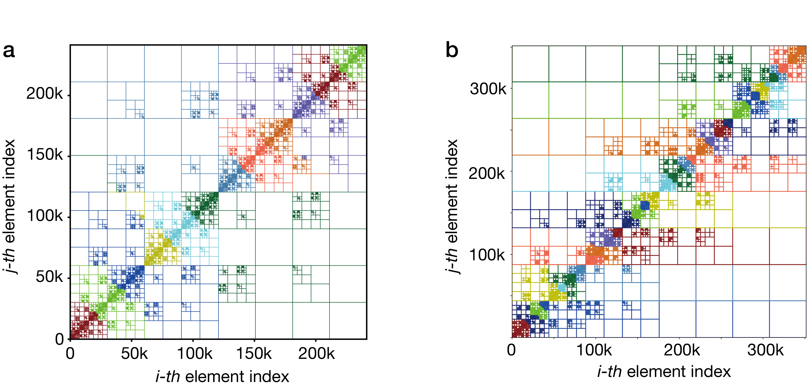
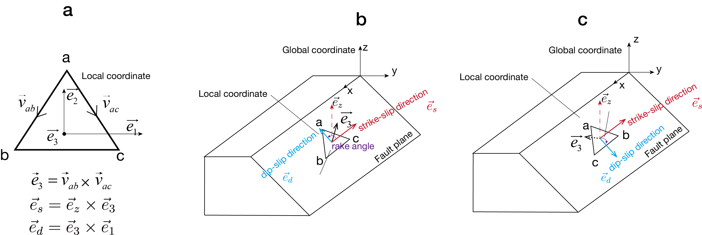

Theoretical background
======================
Governing Equations for Quasi-dynamic Model
-------------------------------------------
In this section, we first present the governing equations of the classical quasi-dynamic seismic cycle
and the boundary element method used to solve them. We then discuss shear-induced dilatation and the
thermal pressurization process caused by frictional heating, and introduce the finite difference method
employed for their numerical solution. Finally, we provide detailed descriptions of the Hierarchical
matrix (Hmatrix) method and the Lattice Hmatrix method.

To solve the earthquake dynamic simulation problem using boundary integral equations, we assume that the
fault plane is embedded in an elastic half-space or full-space with homogeneous and constant elastic
moduli. A constant tectonic loading rate is imposed across the entire fault interface. The elastic stress
transfer induced by fault slip is described by Equations (1) and (2), corresponding to shear stress and
normal stress, respectively, under the radiation damping assumption :cite:p:`rice1993spatio`:

.. math::
   :label: forcebalance

   \tau_i = \tau_0 - \sum_{j=1}^{n} k_{ij}^s \left( u_j - V_{pl} t \right)
   - \frac{\mu}{2 c_s} \frac{\partial u_i}{\partial t}
  
.. math::
   :label: normalstressbalance

   \bar{\sigma}_i = \bar{\sigma}_0 + \sum_{j=1}^{n} k_{ij}^N
   \left( u_j - V_{pl} t \right)

where :math:`V_{pl}` is the imposed tectonic slip rate, :math:`\mu` is the shear modulus,
:math:`c_s` is the shear wave speed, and :math:`u_j` is the slip at the *j*-th element.
The kernels :math:`k_{ij}^s` and :math:`k_{ij}^N` represent the shear and normal stiffness
matrices, respectively. The last term in Equation :eq:`forcebalance` captures radiation
damping and approximates inertial effects, which is adopted to avoid the unbounded slip
velocity that would otherwise develop as a consequence of instability in a quasi-static
model :cite:`rice1993spatio`.

To compute :math:`k_{ij}^s` and :math:`k_{ij}^N`, we employ analytical formulas for static
stress induced by triangular dislocations in a homogeneous elastic full-space and
half-space, as described by :cite:`nikkhoo2015triangular`. Since our objective is to
simulate three-dimensional complex non-planar fault geometries, optimizations specific to
planar faults, such as constructing the stiffness matrix in the Fourier domain
:cite:`rice1993spatio` and leveraging translational invariance to compute stresses as
convolutions using the Fast Fourier Transform, are not applicable. Instead, we utilize
CPU-based multiprocessing or MPI to accelerate the computation of Green's functions
required for generating the stiffness matrix.

To construct the differential equations, we take the time derivatives of Equations
:eq:`forcebalance` and :eq:`normalstressbalance`, while accounting for the external stress
loading.

.. math::
   :label: VKs

   \frac{d \tau_i}{dt}
   = - \sum_{j=1}^{N} k_{ij}^s \left( V_j - V_{pl} \right)
     + \dot{\tau}_i
     - \frac{\mu}{2 c_s} \frac{d V_i}{dt}

.. math::
   :label: VKn

   \frac{d \sigma_i}{dt}
   = \sum_{j=1}^{N} k_{ij}^N V_j
     + \dot{\sigma}_i

where :math:`\dot{\tau}_i` and :math:`\dot{\sigma}_i` represent the tectonic loading
rates for shear and normal stresses on the *i*-th fault cell, respectively.

To solve the differential Equations :eq:`VKs` and :eq:`VKn`, we incorporate boundary
conditions governed by the laboratory-derived rate- and state-dependent friction
(RSF) law :cite:`dieterich1979modeling_b,ruina1983slip`. The friction coefficient is
given by a regularized aging-law formulation as

.. math::

   f(V, \theta)
   = a \sinh^{-1} \left[
     \frac{V}{2 V_0}
     \exp \left(
       \frac{f_0 + b \ln \left( \frac{V_0 \theta}{d_c} \right)}{a}
     \right)
   \right]

.. math::
   :label: dthetadt

   \frac{d \theta}{dt}
   = 1 - \frac{V \theta}{d_c}

where :math:`d_c` represents the characteristic slip distance,
:math:`V_0` the reference slip rate,
:math:`f_0` the reference friction coefficient,
and :math:`\theta` the state variable.
The parameters :math:`a` and :math:`b` describe the direct and evolutionary
effects of shear resistance during and following a velocity step.

To simplify the formulation, we replace the state variable
:math:`\theta` with a transformed variable :math:`\psi`,

.. math::
   :label: psi_def

   \psi = f_0 + b \ln \left( \frac{V_0 \theta}{d_c} \right)

The transformed friction relation then becomes

.. math::
   :label: fric

   \frac{\tau_i}{\sigma_i}
   =
   a \sinh^{-1}
   \left(
   \frac{V_i}{2V_0}
   \exp\left(\frac{\psi_i}{a}\right)
   \right)

and the corresponding state evolution equation is

.. math::
   :label: dfaidt

   \frac{d\psi_i}{dt}
   =
   \frac{b}{d_c}
   \left[
   V_0 \exp\left( \frac{f_0 - \psi_i}{b} \right)
   - V_i
   \right]

We now return to Equation :eq:`VKs`. The time derivative of slip rate
:math:`dV_i/dt` can be expressed using the chain rule as

.. math::
   :label: chainKs

   \frac{dV_i}{dt}
   =
   \frac{\partial V_i}{\partial \tau_i} \frac{d\tau_i}{dt}
   +
   \frac{\partial V_i}{\partial \sigma_i} \frac{d\sigma_i}{dt}
   +
   \frac{\partial V_i}{\partial \psi_i} \frac{d\psi_i}{dt}

Substituting this relation into Equation :eq:`VKs` yields the final
expression for the shear stress evolution,

.. math::
   :label: dtaodt

   \frac{d\tau_i}{dt}
   =
   \left(
   1 + \frac{\mu}{2c_s}
   \frac{\partial V_i}{\partial \tau_i}
   \right)^{-1}
   \left[
   -\sum_{j=1}^{N} k_{ij}^s V_j
   + \dot{\tau}_i
   - \frac{\mu}{2c_s}
   \left(
   \frac{\partial V_i}{\partial \sigma_i} \frac{d\sigma_i}{dt}
   +
   \frac{\partial V_i}{\partial \psi_i} \frac{d\psi_i}{dt}
   \right)
   \right]

The shear stress is further decomposed into strike-slip and dip-slip
components, denoted by :math:`\tau_{1}` and :math:`\tau_{2}`, with
corresponding slip rates :math:`V_1` and :math:`V_2`.

For the strike-slip component,

.. math::
   :label: Ks_0

   \frac{d\tau_{1,i}}{dt}
   =
   \left(
   1 + \frac{\mu}{2c_s}
   \frac{\partial V_{1,i}}{\partial \tau_{1,i}}
   \right)^{-1}
   \left[
   -\sum_{j=1}^{N} k_{ij}^{s1} V_{1,j}
   + \dot{\tau}_{1,i}
   - \frac{\mu}{2c_s}
   \left(
   \frac{\partial V_{1,i}}{\partial \sigma_i} \frac{d\sigma_i}{dt}
   +
   \frac{\partial V_{1,i}}{\partial \psi_i} \frac{d\psi_i}{dt}
   \right)
   \right]

and for the dip-slip component,

.. math::
   :label: Ks_1

   \frac{d\tau_{2,i}}{dt}
   =
   \left(
   1 + \frac{\mu}{2c_s}
   \frac{\partial V_{2,i}}{\partial \tau_{2,i}}
   \right)^{-1}
   \left[
   -\sum_{j=1}^{N} k_{ij}^{s2} V_{2,j}
   + \dot{\tau}_{2,i}
   - \frac{\mu}{2c_s}
   \left(
   \frac{\partial V_{2,i}}{\partial \sigma_i} \frac{d\sigma_i}{dt}
   +
   \frac{\partial V_{2,i}}{\partial \psi_i} \frac{d\psi_i}{dt}
   \right)
   \right]

where the partial derivatives are given by

.. math::
   :label: dvdtau

   \frac{\partial V_{1,i}}{\partial \tau_{1,i}}
   =
   \frac{2V_0}{a \sigma_i}
   \exp\left(-\frac{\psi_i}{a}\right)
   \cosh\left(\frac{\tau_{1,i}}{a \sigma_i}\right)

.. math::

   \frac{\partial V_{2,i}}{\partial \tau_{2,i}}
   =
   \frac{2V_0}{a \sigma_i}
   \exp\left(-\frac{\psi_i}{a}\right)
   \cosh\left(\frac{\tau_{2,i}}{a \sigma_i}\right)

.. math::

   \frac{\partial V_{1,i}}{\partial \sigma_i}
   =
   -\frac{2V_0 \tau_{1,i}}{a \sigma_i^2}
   \exp\left(-\frac{\psi_i}{a}\right)
   \cosh\left(\frac{\tau_{1,i}}{a \sigma_i}\right)

.. math::

   \frac{\partial V_{2,i}}{\partial \sigma_i}
   =
   -\frac{2V_0 \tau_{2,i}}{a \sigma_i^2}
   \exp\left(-\frac{\psi_i}{a}\right)
   \cosh\left(\frac{\tau_{2,i}}{a \sigma_i}\right)

.. math::

   \frac{\partial V_{1,i}}{\partial \psi_i}
   =
   -\frac{2V_0}{a}
   \exp\left(-\frac{\psi_i}{a}\right)
   \sinh\left(\frac{\tau_{1,i}}{a \sigma_i}\right)

.. math::
   :label: dv_dfai

   \frac{\partial V_{2,i}}{\partial \psi_i}
   =
   -\frac{2V_0}{a}
   \exp\left(-\frac{\psi_i}{a}\right)
   \sinh\left(\frac{\tau_{2,i}}{a \sigma_i}\right)

We use the backslip method :cite:`heimisson2020crack`) with a plate rate
:math:`V_{pl}` for plate motion loading, such that
:math:`V_{1,i}` and :math:`V_{2,i}` can be replaced by
:math:`V_{1,i}-V_{pl,i}` and :math:`V_{2,i}-V_{pl,i}`.

By substituting Equations :eq:`dvdtau` to :eq:`dv_dfai` into
Equations :eq:`Ks_0` and :eq:`Ks_1`, along with
Equations :eq:`VKn`, :eq:`dfaidt`, :eq:`Ks_0`, and :eq:`Ks_1`,
we obtain a system of ordinary differential equations (ODEs) of dimension
:math:`4N`:

.. math::
   :label: ode

   \frac{dy}{dt} = f(y)

.. math::

   y = (\psi_1, \dots, \psi_N,
        \tau_{1,1}, \dots, \tau_{1,N},
        \tau_{2,1}, \dots, \tau_{2,N},
        \sigma_1, \dots, \sigma_N)

We solve these ODEs using the Dormand-Prince 5th-order Runge–Kutta method
with adaptive time stepping (:cite:`press2007numerical`). After each iteration,
other important variables such as slip velocity, shear traction amplitude, and
rake angle are updated by the following formulas:

.. math::

   \tau = \sqrt{\tau_1^2 + \tau_2^2}

.. math::

   V_1 = 2 V_0 \cdot \exp\left(-\frac{\psi}{a}\right)
         \cdot \sinh\left(\frac{\tau_1}{a \sigma}\right)

.. math::

   V_2 = 2 V_0 \cdot \exp\left(-\frac{\psi}{a}\right)
         \cdot \sinh\left(\frac{\tau_2}{a \sigma}\right)

.. math::

   V = \sqrt{V_1^2 + V_2^2}

.. math::

   \text{rake} = \arctan\left(\frac{\tau_2}{\tau_1}\right)

To implement adaptive time stepping, the step size for the next iteration
:math:`h_{n+1}` is calculated based on the relative error between the
4th- and 5th-order Runge-Kutta formulas:

.. math::
   :label: timestep

   h_{n+1} = S h_n \left( \frac{\epsilon_0}{\epsilon_k} \right)^{0.2}

where the safety factor :math:`S = 0.9` and
:math:`\epsilon_0 = 10^{-4}` is the set threshold for desired precision.
The relative error is computed as

.. math::

   \epsilon_k = \max \left( \left| \frac{y_{n+1} - y_{n+1}^*}{y_{n+1}} \right| \right)

Here, :math:`y_{n+1}^*` is the result of the fifth-order computation, and
:math:`y_{n+1}` is the result of the fourth-order computation. For each
Runge–Kutta iteration, we first check if
:math:`\frac{\epsilon_0}{\epsilon_k} < 1.0`. If it is, we update the time
step using Equation :eq:`timestep` and then constrain
:math:`h_{n+1} = \min(1.5 h_n, h_{n+1})`. Otherwise, we update the step size
using Equation :eq:`timestep` and then constrain
:math:`h_{n+1} = \max(0.5 h_n, h_{n+1})`. The Runge-Kutta iteration is
re-executed until the condition becomes less than 1.0 or the maximum number
of iterations is reached.

To ensure numerical resolution of rupture, we monitor two key physical
length scales. The first is the process zone size :math:`\Lambda`, given by:

.. math::

   \Lambda = C \; \frac{\mu \; d_c}{b \; \sigma_n}

which characterizes the breakdown zone near the rupture front. The constant
:math:`C` is equal to :math:`9 \pi/32` (:cite:`lapusta2009three`). Three-dimensional
dynamic rupture simulations by :cite:`day2005comparison` demonstrated that a
resolution of at least :math:`\Lambda/\Delta x = 3--5` is required to adequately
capture the physical features of rupture propagation.

The second critical length scale is the nucleation size :math:`h^*`, defined as
(:cite:`rice1983stability,rubin2005earthquake,chen2009scaling`):

.. math::

   h^* = \frac{\pi}{2} \cdot \frac{\mu \, b \, d_c}{(b - a)^2 \, \sigma_n}

This scale governs the minimum size of the VW patch required for spontaneous
nucleation. These two length scales (:math:`\Lambda`, :math:`h^*`) must be
appropriately resolved by the mesh to ensure physically meaningful and
numerically stable earthquake cycle simulations.

Fluid diffusion equation and Dilatancy Law
------------------------------------------
We model earthquake cycles with 3-D elasticity, rate-state friction, and a dilatancy law where porosity evolves toward steady state over distance :math:`d_c`, using BIEM coupled with Finite Difference Method (FDM). Following :cite:`segall1995dilatancy` and :cite:`segall2010dilatant`, we assume a constitutive equation for the inelastic change in porosity :math:`\phi`, including both dilatancy and compaction. We associate dilatancy/compaction with changes in the average lifetime of asperity contacts within the fault gouge, such that

.. math::

   \phi = -\epsilon \ln \left( \frac{V_0 \theta}{d_c} \right)

.. math::
   :label: dfdt

   \frac{d\phi}{dt}
   = -\epsilon \frac{d}{dt} \ln \left( \frac{V_0 \theta}{d_c} \right)
   = -\frac{\epsilon}{\theta} \frac{d\theta}{dt}

Where :math:`\epsilon` represents the empirically derived constant of order :math:`10^{-4}`, based on :cite:`marone1990frictional` experiments. Above steady state, that is for :math:`\theta > d_c / V`, :math:`\theta` decreases :eq:`dthetadt`, and the gouge dilates, while below steady state, :math:`\theta` increases and the gouge compacts.

To investigate the role of dilatancy in earthquake cycles we consider coupled friction, dilatancy and pore fluid flow. We consider homogeneous diffusion model which accurately models fault‐normal flow with diffusivity :math:`C_{hyd}`. We assume dilatancy greatly dominates effects of temperature :math:`T` and pore pressure :math:`p` variation on porosity change within the thin shearing layer :math:`h`. Neglecting pore fluid flow parallel to the fault, for the same reason that heat flow in this direction is negligible, changes in pore pressure in the rock surrounding the shear zone is given by :cite:`segall2010dilatant` and :cite:`segall2006does`

.. math::
   :label: fluid eqs

   \frac{\partial p}{\partial t}
   = c_{hyd} \frac{\partial^2 p}{\partial y^2}
   + \Lambda \frac{\partial T}{\partial t} ;
   \quad
   \left. \frac{\partial p}{\partial y} \right|_{y=0^+}
   = \frac{(1 - \phi) \dot{h}}{2 \beta c_{hyd}}
   = \frac{h \dot{\phi}}{2 \beta c_{hyd}}

Where hydraulic diffusivity :math:`C_{hyd} = \kappa/{\eta \beta}`, :math:`\kappa` is the permeability, :math:`\eta` is pore fluid viscosity and :math:`\beta` is compressibility of the fluid and the pore space. :math:`\Lambda` is the thermal pressurization coupling parameter, equal to the ratio of thermal expansivity to compressibility. If we ignore the temperature requirement, such a simplified diffusion equation yeild

.. math::
   :label: diffusion

   \frac{\partial p}{\partial t}
   = c_{hyd} \frac{\partial^2 p}{\partial y^2};
   \quad
   \left. \frac{\partial p}{\partial y} \right|_{y=0^+}
   = \frac{h \dot{\phi}}{2 \beta c_{hyd}}

Thermal Pressurization
----------------------
Thermal pressurization occurs when fluids within the fault heat up, expand,
and pressurize during dynamic rupture, reducing the effective normal stress
:cite:`rice2006heating,noda2010three`. The thermal pressurization effect is
governed in our model by the following coupled differential equations for
pressure :eq:`fluid eqs` and temperature evolution
:cite:`noda2010three`:

.. math::
   \frac{\partial p}{\partial t}
   = c_{hy} \frac{\partial^2 p}{\partial y^2}
   + \Lambda \frac{\partial T}{\partial t}
   :label: fluid_eqs1

.. math::
   \frac{\partial T}{\partial t}
   = \alpha_{th} \frac{\partial^2 T}{\partial y^2}
   + \frac{\tau V \exp\left(-y^2 / (2 w^2)\right)}
          {\rho c \sqrt{2 \pi} w}
   :label: temp

with boundary condition if only considering thermal pressurization:

.. math::
   \left. \frac{\partial p}{\partial y} \right|_{y=0^+} = 0,
   \qquad
   \left. \frac{\partial T}{\partial y} \right|_{y=0^+} = 0

Or implementing coupling thermal pressurization and dilatation:

.. math::
   \left. \frac{\partial p}{\partial y} \right|_{y=0^+}
   = \frac{h \dot{\phi}}{2 \beta c_{hyd}},
   \qquad
   \left. \frac{\partial T}{\partial y} \right|_{y=0^+} = 0

where :math:`T` is the temperature of the pore fluid,
:math:`c_{hy}` is the hydraulic diffusivity,
:math:`\alpha_{th}` is the thermal diffusivity,
:math:`\tau V` is the source of shear heating distributed over the shear zone
of half-width :math:`w`,
:math:`\rho c` is the specific heat,
:math:`y` is the distance normal to the fault plane,
and :math:`\Lambda` is the coupling coefficient that gives pore pressure change
per unit temperature change under undrained conditions.

Dilatancy arises from an increase in porosity, which causes a drop in pore fluid
pressure and, consequently, a rise in effective normal stress. Thermal
pressurization, by contrast, induces the opposite effect. As such, these
represent a fundamental trade-off in fault mechanics.

Coupled solution of friction mechanics and diffusion equation using BIEM and FDM
--------------------------------------------------------------------------------
The coupling between the frictional relation and pore pressure is incorporated
by modifying Equation :eq:`fric` as

.. math::
   \frac{\tau_{i}}{\sigma_{i}-p}
   = a \arcsin(h)\left(
     \frac{V_{i}}{2V_0}
     \exp\left(\frac{\psi_i}{a}\right)
     \right)
   :label: fricp

Accordingly, the chain rule must be corrected to

.. math::
   \frac{dV_i}{dt}
   = \frac{\partial V_i}{\partial \tau_i} \frac{d\tau_i}{dt}
   + \frac{\partial V_i}{\partial \sigma_i} \frac{d\sigma_i}{dt}
   + \frac{\partial V_i}{\partial \psi_i} \frac{d\psi_i}{dt}
   + \frac{\partial V_i}{\partial p_i} \frac{d p_i}{dt}
   :label: chainKs1

With this modification, the corresponding Equation :eq:`dtaodt` becomes

.. math::
   \frac{d\tau_i}{dt}
   = \left(
     1 + \frac{\mu}{2c_s}
     \frac{\partial V_i}{\partial \tau_i}
     \right)^{-1}
     \Bigg[
     -\sum_{j=1}^N k_{ij}^s V_j
     + \dot{\tau}_i
     - \frac{\mu}{2c_s}
       \left(
       \frac{\partial V_i}{\partial \sigma_i}
       \left(
       \frac{d\sigma_i}{dt}
       - \frac{d p_i}{dt}
       \right)
       + \frac{\partial V_i}{\partial \psi_i}
         \frac{d\psi_i}{dt}
       \right)
     \Bigg]

The Equations :eq:`Ks_0` and :eq:`Ks_1` should be revised in the same manner.
Furthermore, in Equations :eq:`dvdtau` to :eq:`dv_dfai`, the normal stress
:math:`\sigma` must be replaced by the effective normal stress
:math:`\sigma - p`.

The problem now becomes solving the ordinary differential equations system
:eq:`VKn`, :eq:`dfaidt`, modified :eq:`Ks_0` and :eq:`Ks_1`, as well as the
diffusion Equation :eq:`diffusion`. The first four differential equations are
still solved using the Runge-Kutta method, which interacts with the diffusion
equation through :math:`p` and :math:`dp/dt`, while the diffusion equation is
solved using finite difference method, which interacts with the friction
mechanics through the state variable (Equation :eq:`dfdt`). Then multi-physics
coupling is ultimately solved iteratively using the partitioned approach.

Near the fault it is important that the discretization be sufficiently fine to
capture the steep gradient in :math:`p`. To achieve this we make the following
change of coordinate between :math:`y` and :math:`z`:

.. math::
   z(y) = \ln(1 + y/c)

Where :math:`y` is fault-normal distance. This change of coordinate has the
effect of making the mesh dense near the fault and sparse near
:math:`y = y_\infty`. :math:`y_\infty` is set to be the distance 10 m far away
from the fault plane and has background pore pressure. The constant :math:`c`
is set to :math:`10^{-2}` to yield good results.

Following the change of coordinate, the system of equations :eq:`diffusion`
is converted to :cite:`segall2010dilatant`

.. math::
   \dot{p}
   = c_{hyd} \, e^{-z}
     \left( e^{-z} p_z \right)_z
   \quad \text{on } y > 0
   :label: eq:B9

.. math::
   e^{-z} p_z = g
   \quad \text{on } y = 0
   :label: eq:B10

.. math::
   p = p_\infty
   \quad \text{on } y = y_\infty
   :label: eq:B11

We discretize the PDE and boundary conditions :eq:`eq:B9` in space, letting
:math:`\delta = \Delta z / 2`,

.. math::
   \dot{p}_k
   = c_{hyd} e^{-z_k}
     \left(
     \frac{
       -e^{-(z_k - \delta)} (p_k - p_{k-1})
       + e^{-(z_k + \delta)} (p_{k+1} - p_k)
     }{\Delta z^2}
     \right)
   :label: eq:B12

.. math::
   e^{-z_0}
   \frac{p_1 - p_{-1}}{2\Delta z}
   = g
   \quad \text{on } y = 0
   :label: eq:B13

.. math::
   p_K = p_\infty
   \quad \text{on } y = y_\infty
   :label: eq:B13_

for :math:`k = 0, 1, \ldots, K`. The discretization :eq:`eq:B9` is a
second-order-accurate conservative discretization of the gradient of the flux
function :math:`e^{-z} p_z`. The discretization of the Neumann boundary
condition :eq:`eq:B13` is a second-order-accurate approximation centered around
:math:`k = 0`. Note that the ghost variable :math:`p_{-1}` is eliminated when
:eq:`eq:B13` is introduced into :eq:`eq:B12`.

We next consider the method for time stepping the system of equations. Let
:math:`p^{n}_{km}` be the value of :math:`p` at the :math:`k`-th point in the
:math:`y` direction and the :math:`m`-th point in the :math:`x` direction, at
the :math:`n`-th time step. For simplicity in presentation we illustrate the
time stepping procedure for the spatially uniform, rather than log
discretization. Equations :eq:`eq:B9` and :eq:`eq:B10` are discretized in time
as:

.. math::
   \frac{p^{n+1}_{km} - p^n_{km}}{\Delta t}
   = c_{hyd}
     \left(
     \frac{
       p^{n+1}_{(k-1)m}
       - 2 p^{n+1}_{km}
       + p^{n+1}_{(k+1)m}
     }{\Delta y^2}
     \right)

.. math::
   \frac{p^{n+1}_{1m} - p^{n+1}_{(-1)m}}{2\Delta y}
   = g(u^{n+1}_m),
   \quad
   p^{n+1}_{Km} = p_\infty

where :math:`m = 1, \ldots, M` and :math:`k = 1, \ldots, K`. Note that the
equations for :math:`p` are implicit in that pore pressure at time step
:math:`n+1` depends on :math:`p^{n+1}`. An important feature is that for each
position along the fault (indexed by :math:`m`), the pore pressure along the
fault-normal profile depends only on the quantities at index :math:`m`. Thus,
the pore pressures on the fault are only coupled through the
friction/elasticity equations. The finite difference computations along the
fault therefore decouple, such that :math:`M` small systems of equations (with
:math:`K` elements) are solved at each time step using MPI, rather than one
large system of equations. This is vastly more efficient than solving the full
implicit equations.

We can solve the temperature-dependent diffusion equations using nearly
identical procedural steps. This involves a staggered coupling scheme to
iteratively resolve the distinct equations: first, apply the finite difference
method to Equation :eq:`temp`, capturing how variations in stress and slip
velocity drive temperature evolution; next, leverage the temperature rate of
change to solve Equation :eq:`fluid_eqs1` via finite difference
discretization; then, incorporating the coupled pore pressure
Equation :eq:`fricp`, employ the boundary integral equation method to solve
ODE Equation :eq:`ode`, thereby determining the slip rate and shear stress;
finally, advance to Equation :eq:`temp` for the subsequent time step,
repeating the cycle as needed.

Hierarchical Matrix Compression and MPI Parallelization in PyQuake3D
--------------------------------------------------------------------

According to :cite:`borm2003introduction`, PyQuake3D implements a
Python-based H-matrix framework from the ground up. The implementation,
contained in the ``Hmatrix.py`` module, supports MPI-based parallel
acceleration and is designed with modularity, making it easily separable and
adaptable for use in other applications.

The core idea of the H-matrix is to apply low-rank approximation to
far-field submatrices while keeping the dense near-field submatrices.
Therefore, the essential purpose is to decompose the original matrix in a
reasonable and efficient manner and to identify the submatrices suitable for
low-rank approximation. The structure of the H-matrix is built upon a cluster
tree and a block tree. The construction begins with generating a cluster tree
based on the element index, which is then used to form the block cluster tree
through pairwise combinations of the clusters. The implementation of H-matrices
in *PyQuake3D* includes four parts: cluster tree construction, block cluster
tree generation, low-rank approximation, as well as MPI acceleration.

Cluster and Block tree construction
~~~~~~~~~~~~~~~~~~~~~~~~~~~~~~~~~~~

A simple method of building a cluster tree is based on geometry-based
splittings of the index set. The unit coordinates in 3D space are the basis
:math:`\{e_x, e_y, e_z\}` of the canonical unit vectors. The following
algorithm will split a given cluster :math:`\tau \subset I` into two sons
such that the points with canonical coordinate :math:`x_i` are separated by a
hyper-plane.

.. code-block:: text
   :caption: Geometric Splitting of an Index Cluster
   :name: cluster-split

   Procedure Split(τ, var τ_1, var τ_2)
       # Choose a direction for geometrical splitting of the cluster τ
       for j := 1 to d:
           α_j := min{ <e_j, x_i> : i ∈ τ }  # <·,·> is the ℝ^d Euclidean product, d=3
           β_j := max{ <e_j, x_i> : i ∈ τ }
       j_max := argmax{ β_j - α_j : j ∈ {1,...,d} }
       # Split the cluster τ in the chosen direction
       γ := (α_{j_max} + β_{j_max}) / 2
       τ_1 := ∅;  τ_2 := ∅
       for i ∈ τ:
           if <e_{j_max}, x_i> ≤ γ:
               τ_1 := τ_1 ∪ {i}
           else:
               τ_2 := τ_2 ∪ {i}
       end for
   end procedure

The cluster tree can be used to define a block tree by forming pairs of clusters recursively, and an admissibility condition is constructed by the following procedure (Algorithm :numref:`cluster-split`).

----

**Algorithm: Build BlockTree**

.. _alg-blocktree:
.. code-block:: text
   :caption: BuildBlockTree
   :name: BuildBlockTree

   Procedure BuildBlockTree(τ × σ)
       begin
           if τ × σ is not admissible and |τ| > C_leaf and |σ| > C_leaf then
               begin
                   S(τ × σ) := { τ′ × σ′ : τ′ ∈ S(τ), σ′ ∈ S(σ) }
                   for τ′ × σ′ ∈ S(τ × σ) do
                       BuildBlockTree(τ′ × σ′)
                   end for
               end
           else
               S(τ × σ) := ∅
           end if
       end

For a pair of index clusters :math:`(τ, σ)`, the corresponding submatrix is :math:`A_{τ, σ}`. These matrix blocks are organized into a block cluster tree, 
which guides the hierarchical representation of :math:`A`. If the clusters :math:`t` and :math:`s` are both non-leaf nodes with children :math:`t₁, t₂` and :math:`s₁, s₂` respectively, the submatrix :math:`A_{ts}` can be further decomposed into four submatrices (:numref:`Hmatrix_MPI` a).

.. _Hmatrix_MPI:
.. figure:: _static/Hmatrix_MPI.png
   :alt: Construction of hierarchical matrix speed up by MPI
   :align: center
   :width: 800px

   Construction of hierarchical matrix speed up by MPI

Admissibility Condition
~~~~~~~~~~~~~~~~~~~~~~~

Matrix blocks :math:`A_{τ, σ}` are classified into *admissible* and *inadmissible* based on the geometric configuration of :math:`τ` and :math:`σ`. We need an admissibility condition that allows us to check if a candidate :math:`(τ × σ)` allows for a suitable low rank approximation (Algorithm :numref:`alg-blocktree`).

A relatively general and practical admissibility condition for clusters in :math:`ℝ^d` can be defined by using bounding boxes: We define the canonical coordinate maps

.. math::

   \pi_k : \mathbb{R}^d \rightarrow \mathbb{R}, \quad x \mapsto x_k,

*for all* :math:`k ∈ {1, …, d}` *(d = 3 in 3D space).* The bounding box for a cluster :math:`τ` is then given by

.. math::

   Q_\tau := \prod_{k=1}^{d} [a_{\tau,k}, b_{\tau,k}], \quad \text{where} \quad
   a_{\tau,k} := \min(\pi_k \Omega_\tau) \quad \text{and} \quad
   b_{\tau,k} := \max(\pi_k \Omega_\tau).

Obviously, :math:`a_{τ,k}` and :math:`b_{τ,k}` are the minimum and maximum value in the k-th dimension of the coordinate set :math:`Ω_τ`, we have :math:`Ω_τ ⊆ Q_τ`, so we can define the admissibility condition

.. math::

   \min\{\mathrm{diam}(Q_\tau), \mathrm{diam}(Q_\sigma)\}
   \leq \eta\, \mathrm{dist}(Q_\tau, Q_\sigma)

We can compute the diameters and distances of the boxes by

.. math::

   \mathrm{diam}(Q_\tau)
   =
   \left(
       \sum_{k=1}^{d} (b_{\tau,k} - a_{\tau,k})^2
   \right)^{1/2}

and

.. math::

   \mathrm{dist}(Q_\tau, Q_\sigma)
   =
   \left(
       \sum_{k=1}^{d}
       \left(
           \max(0, a_{\tau,k} - b_{\sigma,k})^2
           +
           \max(0, a_{\sigma,k} - b_{\tau,k})^2
       \right)
   \right)^{1/2}.

Low-Rank Approximation of Admissible Blocks
~~~~~~~~~~~~~~~~~~~~~~~~~~~~~~~~~~~~~~~~~~~

When calculating the stress Green's function, we need to avoid constructing the full dense BEM matrix by Low-Rank Approximation. This can be helpful for reducing memory costs and, in some situations, actually results in a faster solver too.  
Singular value decomposition (SVD) is an extremely efficient approximation, but it still suffers from the need to compute the entire matrix block in the first place, an :math:`O(n^2)` operation!

The most useful solution for our setting is the adaptive cross approximation (ACA) method :cite:`bebendorf2000approximation,rjasanow2007approximation`, but most real-world application use either *ACA with partial pivoting* or the *ACA+* algorithm :cite:`grasedyck2005adaptive`. The basic idea of ACA+ is to approximate a matrix with a rank 1 outer product of one row and one column of that same matrix, and then iteratively use this process to construct an approximation of arbitrary precision. ACA+ uses orthogonal projections and recompression to better control the error and avoid poor pivot choices, and improves the stability and accuracy of the standard ACA.

Parallelization of H-matrix Construction and Matrix-Vector Multiplication with MPI
~~~~~~~~~~~~~~~~~~~~~~~~~~~~~~~~~~~~~~~~~~~~~~~~~~~~~~~~~~~~~~~~~~~~~~~~~~~~~~~~~~~~~~~~~~~~~~~~~~~~~~~~~~~~~~~~~~~~~~~~~~~~

We construct the cluster tree, block cluster tree, and establish the overall H-matrix framework. This includes the initial distribution of the index sets and the assignment of matrix blocks. Once the hierarchical structure is built, the matrix blocks are distributed across different MPI processes for parallel computation of elements (e.g., ``MPI_send``, ``MPI_recv``). We adopt a dynamic task allocation strategy in MPI to mitigate load imbalance issues that may arise from static task assignment  (:numref:`Hmatrix_MPI` d).

Each process is responsible for computing the entries of its assigned matrix blocks. For admissible blocks, a low-rank approximation is performed using the ACA algorithm. For non-admissible blocks, typically corresponding to leaf nodes in the block cluster tree, are the full dense matrix computed by evaluating all pairwise Green's function interactions between source and target elements  (:numref:`Hmatrix_MPI` c).

During matrix-vector multiplication, each process independently computes the product of its local matrix blocks with the corresponding 
portion of the input vector. The final global result vector is then obtained by summing the local contributions across all processes (``MPI_reduce``) (:numref:`Hmatrix_MPI` e).

H-matrix and Lattice H-matrix
~~~~~~~~~~~~~~~~~~~~~~~~~~~~~~~~~~~~~~~~~~~~~~~~~~~~~~~~~~~~~~~~~~~~~~~~~~~~~~~~~~~~~~~~~~~~~~~~~~~~~~~~~~~~~~~~~~~~~~~~~~~~~~~~~~~~

In the conventional H-matrix approach, the MPI_Allreduce (or the Reduce-Broadcast cycle) acts as a "stop-the-world" barrier, where communication costs eventually outpace the actual floating-point math as you scale up.

The transition to a Lattice H-matrix (or 2D-topology H-matrix) effectively localizes these communications. Here is the completion of the comparison, detailing the structural and algorithmic differences:

1. H-Matrix (1D/Global Layout):In a standard implementation, the matrix-vector multiplication (H-Matvec) often treats the slip rate vector as a global entity. Every process involved in the dot product must contribute its local result to a global sum.
   
   Scope: Global. Every process communicates with every other process.

   Barrier: The MPI_Reduce involves all P processes, creating a massive synchronization overhead that scales poorly with high core counts. 
   
2. Lattice H-Matrix (2D/Local Layout):By adopting a 2D MPI Cartesian grid, the Lattice approach partitions the workload such that processes are grouped into row communicators and column communicators.
   
   Scope: Sub-communicators. Summation is restricted to :math:`P_{row}` processes.

   Feasibility: Because the physical domain is discretized into a lattice, the interaction between sub-blocks is localized. Slip rate updates only need to be synchronized across diagonal processes or specific neighbors, rather than the entire cluster.

.. _HM_LHM:

   Comparison of structure of H-Matrix and Lattice H-Matrix.(**a**) H-Matrix. All processes participate in the global decomposition of the H-matrix. (**b**) Lattice H-Matrix. The Lattice H-Matrix partitions the matrix into sub-blocks that are distributed across a 2D grid of MPI processes, allowing for more localized communication patterns and improved scalability.Balance the distribution of H-submatrices across all processes within each row communicator.

Definitions of Slip Directions and Coordinate Systems
------------------------------------------------------------------------------------------------

The rake angle is defined as the angle between the fault slip vector and the fault strike direction within the fault plane. In seismology, the strike direction is conventionally defined: when facing the dip direction of the fault plane, the strike is taken to be to the observer’s right—this follows the right-hand rule. In *PyQuake3D*, Based on the code you provided, here is a clear explanation of how you are building a Local Coordinate System for a triangular fault element, which is determined by the ordering of the element's nodes—either clockwise or counterclockwise.

To get the defined strike-slip direction for each element, we first calculate the normal vector of the element in the global coordinate system by

.. math::

   \vec{e}_3 = \vec{v}_{ab} \times \vec{v}_{ac}

By crossing the vertical unit vector :math:`\vec{e}_z` with the fault normal :math:`\vec{e}_3`(:numref:`strike_vector`), the code finds a vector that is both in the plane (perpendicular to the normal) and horizontal (perpendicular to :math:`\vec{e}_z`), which is defined as the strike-slip direction. Then the local coordinate system can be obtained by

.. math::
   \vec{e}_1 = \vec{e}_{z} \times \vec{e}_{3}\\
   \vec{e}_2 = \vec{e}_{3} \times \vec{e}_{1}

:numref:`strike_vector` b and c show that the definition of strike slip and dip slip directions obviously depends on the ordering of nodes, so when modeling, we need to first clarify the ordering direction of nodes, and then determine the definition of fault slip direction.

.. _strike_vector:

   Definition of strike-slip and dip-slip direction.(**a**) Calculation of normal vector or z-vector in element local coordinate system :math:`\vec{e}_3`. By crossing the vertical unit vector :math:`\vec{e}_Z` with the fault normal :math:`\vec{e}_3`, the code finds a vector that is both in the plane (perpendicular to the normal) and horizontal (perpendicular to :math:`\vec{e}_Z`)
   (**b**) Looking from the negative direction of the z-axis, the unit nodes are counterclockwise, and the element normal is outwards. The strike-slip direction is defined as the negative x direction, and the y direction can be obtained by cross-producting the z and x unit vectors.
   (**c**) Looking from the negative direction of the z-axis, the unit nodes are clockwise, and the element normal is inwards. The dip-slip direction is defined as the down dip direction.

Coordinate system
--------------------------------------------------------------------

In post-processing, we need to do transforms between local and global coordinates for some vector results, such as slip direction. Base on the relationship in :numref:`strike_vector` d and e, the transform from local coordinates to global coordinates can be obtained by coordinate rotation.

.. math::

   \begin{bmatrix}
   e_{11} & e_{21} & e_{31} \\
   e_{12} & e_{22} & e_{32} \\
   e_{13} & e_{23} & e_{33}
   \end{bmatrix}
   \begin{bmatrix}
   x_1 \\
   x_2 \\
   x_3
   \end{bmatrix}
   =
   \begin{bmatrix}
   X_1 \\
   X_2 \\
   X_3
   \end{bmatrix}

Where x is a vector of local coordinates and X is a vector of global coordinates.

---

References
----------

.. bibliography::
   :style: unsrt
   :filter: docname in docnames